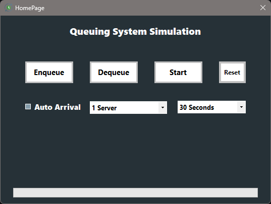

# Queuing System Simulation
- A C++ project that simulates a queuing system with multiple servers, customer arrivals, and performance metrics.

- You can run the program using the `.exe` file "x64/Debug -> QueuingSystemSimulation.exe"

## Bonus Task
The bonus task was completed by:
- Implementing a graphical user interface (GUI) for easier interaction
- Adding additional features to enhance usability and functionality
